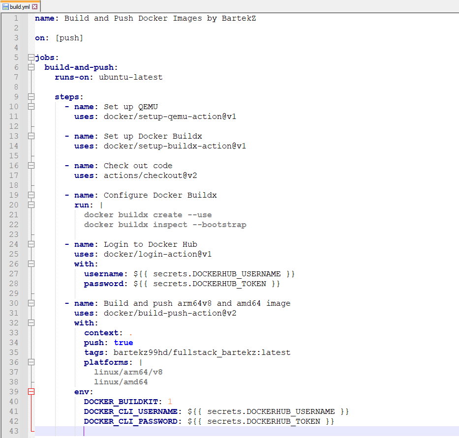
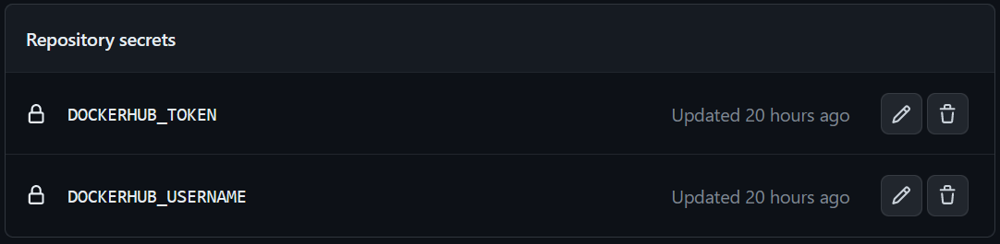
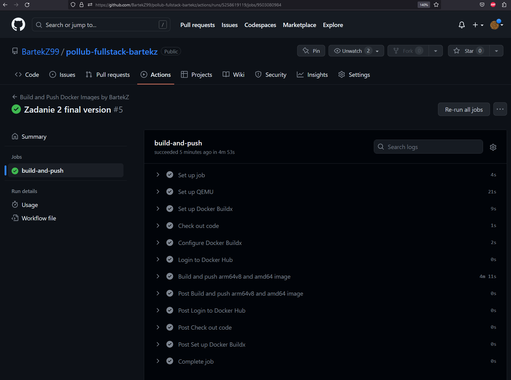
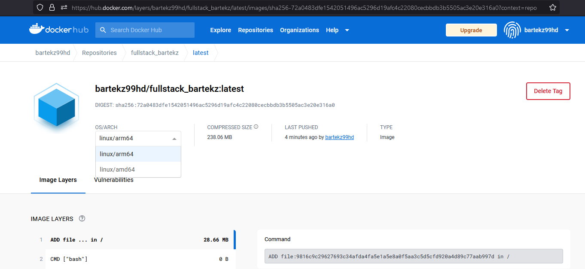

# Sprawozdanie 2 - Programowanie Full-Stack w Chmurze Obliczeniowej
## Autor: Bartosz Zmysłowski

### <b> Zadanie 1 </b>
Wykorzystując opracowaną aplikację (kod + Dockerfile) z zadania nr 1 należy
zbudować, uruchomić i potwierdzić poprawność działania łańcucha Github Actions,
który zbuduje obrazy kontenera z tą aplikacją na architektury: linux/arm64/v8 oraz
linux/amd64 wykorzystując QEMU.

Odpowiedź:
  Kod oprogramowania wraz z komentarzami oraz plik GitHub Actions są dostępne w <b>tym</b> repozytorium
  (<i> https://github.com/BartekZ99/pollub-fullstack-bartekz</i> ).

Zrzut ekranu ukazujący zawartość pliku <b>build.yml</b> GitHub Actions:

(Lokalizacja pliku: /.github/workflows/build.yml)

W pliku widoczne są zmienne <b>DOCKER_CLI_USERNAME</b> oraz <b>DOCKER_CLI_PASSWORD</b>, które są pobierane podczas działania GitHub Action z repozytorium, gdzie przechowywane są w postaci zaszyfrowanych zmiennych:

Są to mój login do DockerHub'a oraz token umożliwiający połączenie z serwisem z "konsoli" (podczas wykonywania się procesu GitHub Action).

Kroki poprzedzające logowanie to głównie konfiguracja QEMU i Buildx oraz "checkout" kodu, aby GH Action mogło z niego korzystać.

Akcja jest zdefiniowana tak, aby po każdej zmianie kodu w repozytorium została wykonana ( <b>on: \[push\]</b> ), a jej działanie można podejrzeć w sekcji <b>Actions</b> repozytorium:

Wykonanie się akcji skutkuje pojawieniem się nowych obrazów w moim repozytorium DockerHub w wersjach na obie platformy (linux/arm64/v8 i linux/amd64) z tagiem <b>latest</b>:

Link do mojego repozytorium DockerHub:
https://hub.docker.com/r/bartekz99hd/fullstack_bartekz/tags