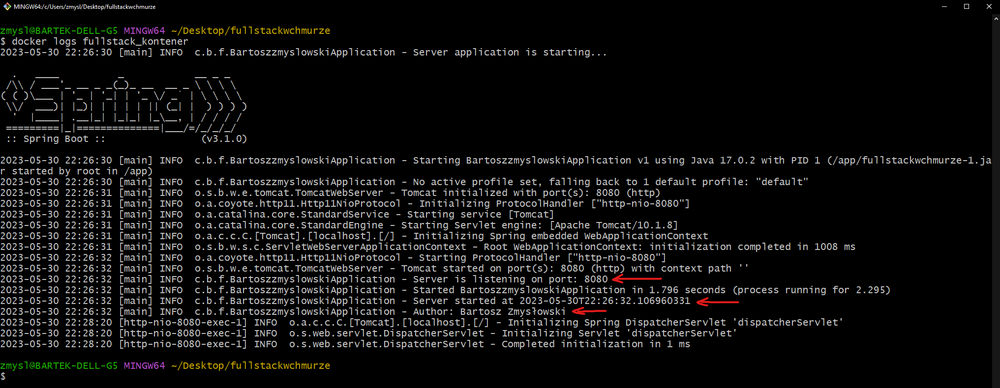
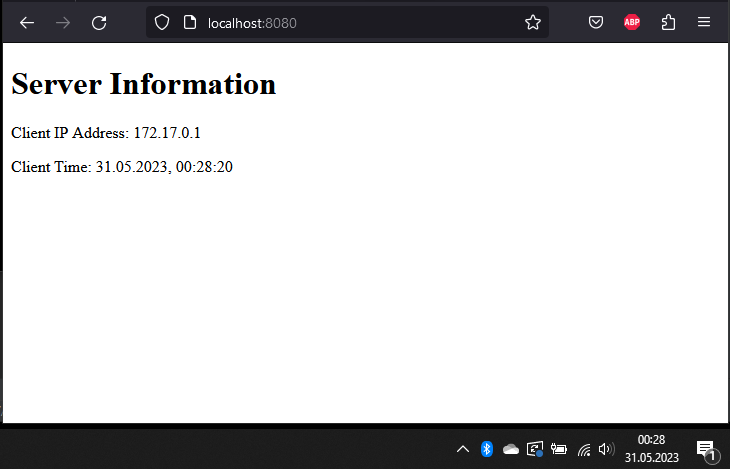
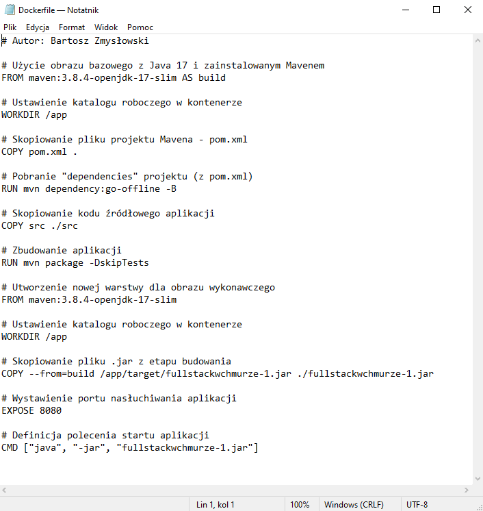

# Sprawozdanie 1 - Programowanie Full-Stack w Chmurze Obliczeniowej
## Autor: Bartosz Zmysłowski

### <b> Zadanie 1 </b>
Proszę napisać program serwera (dowolny język programowania), który realizować będzie
następującą funkcjonalność:
  <b>a.</b> po uruchomieniu kontenera, serwer pozostawia w logach informację o dacie
uruchomienia, imieniu i nazwisku autora serwera (imię i nazwisko studenta) oraz porcie
TCP, na którym serwer nasłuchuje na zgłoszenia klienta.
  <b>b.</b> na podstawie adresu IP klienta łączącego się z serwerem, w przeglądarce powinna
zostać wyświetlona strona informująca o adresie IP klienta i na podstawie tego adresu IP,
o dacie i godzinie w jego strefie czasowej

Odpowiedź:
  Kod oprogramowania wraz z komentarzami jest dostępny w tym repozytorium (<i> https://github.com/BartekZ99/pollub-fullstack-bartekz</i> ).

Zrzut ekranu ukazujący logi serwera:

Zrzut ekranu ukazujący działanie aplikacji w przeglądarce:

### <b> Zadanie 2 </b>
Opracować plik Dockerfile, który pozwoli na zbudowanie obrazu kontenera realizującego
funkcjonalność opisaną w punkcie 1. Przy ocenie brane będzie sposób opracowania tego pliku
(wieloetapowe budowanie obrazu, ewentualne wykorzystanie warstwy scratch, optymalizacja pod
kątem funkcjonowania cache-a w procesie budowania, optymalizacja pod kątem zawartości i ilości
warstw, healthcheck itd ). Dockerfile powinien również zawierać informację o autorze tego pliku
(ponownie imię oraz nazwisko studenta).

Odpowiedź:
  Plik <i> Dockerfile </i> wraz z komentarzami również jest dostępny w tym repozytorium.

Zrzut ekranu ukazujący zawartość pliku <i> Dockerfile </i>:

### <b> Zadanie 3 </b>
Należy podać polecenia niezbędne do:
  <b> a. </b> zbudowania opracowanego obrazu kontenera,
  <b> b. </b> uruchomienia kontenera na podstawie zbudowanego obrazu,
  <b> c. </b> sposobu uzyskania informacji, które wygenerował serwer w trakcie uruchamiana kontenera
(patrz: punkt 1a),
  <b> d. </b> sprawdzenia, ile warstw posiada zbudowany obraz.

Odpowiedzi:
  <b> ad. a. </b> Polecenie służące do budowy obrazu kontenera to:
  <b><i> docker build -t fullstackwchmurze . </i></b>
  gdzie <i> fullstackwchmurze </i> to nadana przeze mnie nazwa obrazu.
 
  <b> ad. b. </b> Polecenie, którego użyłem do uruchomienia kontenera to:
  <b><i> docker run --name fullstack_kontener -p 8080:8080 fullstackwchmurze </i></b>
  gdzie <i> fullstack_kontener </i> to nazwa tworzonego kontenera, a <i> fullstackwchmurze </i> to nazwa utworzonego obrazu, a <i> -p 8080:8080 </i> to przypisanie portu 8080 maszyny lokalnej do portu 8080 kontenera z aplikacją.
 
  <b> ad. c. </b> Polecenie używane w celu wyświetlenia logów kontenera to:
  <b><i> docker logs \<id-kontenera-lub-nazwa\> </i></b>
 
  <b> ad. d. </b> Polecenie, które umożliwia podejrzenie ilości warstw, jaką posiada zbudowany obraz to:
  <b><i> docker history \<id-lub-nazwa-obrazu\> </i></b>
